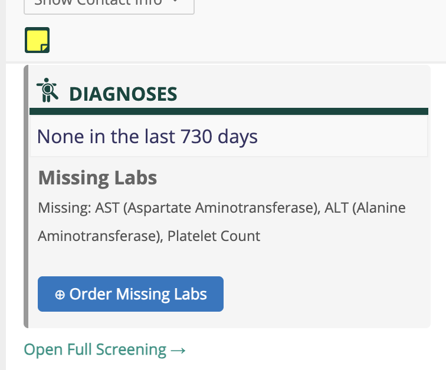
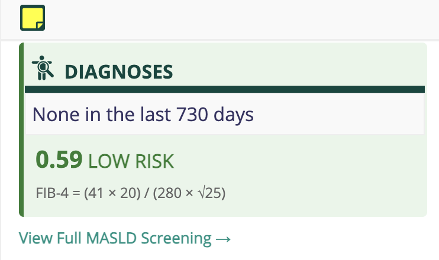
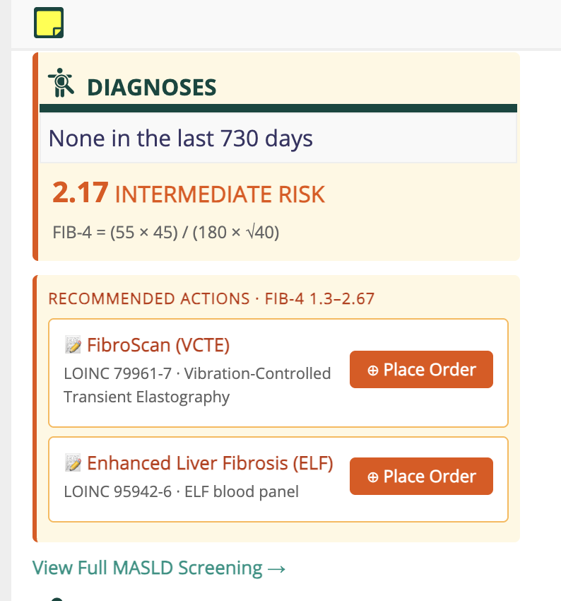
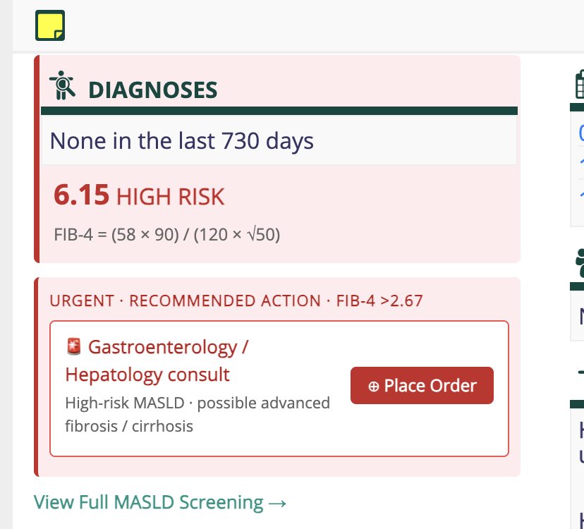

# MASH Care Navigator

**FIB-4 screening for MASLD / MASH at the point of care — SMART-on-FHIR and
EHR-native clinical decision support.**

Metabolic dysfunction-associated steatotic liver disease (MASLD, formerly
NAFLD) is common and usually silent, yet many patients progress to advanced
fibrosis. FIB-4 — a simple index from age, AST, ALT, and platelets — is the
guideline-recommended first-line test for who needs further workup, but in
primary care it gets missed: risk factors go unnoticed, the labs aren't
ordered, the score isn't calculated at the visit, and at-risk patients don't
get their follow-up testing (FibroScan, ELF) or a hepatology referral.

## What it does

Surfaces the FIB-4 score and the right next action in the clinician's dashboard:

- Flags lab gaps and **auto-orders** the missing liver labs (CBC, Hepatic
  Function Panel) in one click.
- **Age-adjusted** lower cutoff — 1.3 default, 2.0 for age ≥ 65 (AGA Clinical
  Care Pathway).
- Risk-tier actions — **intermediate** (1.3 – 2.67) → FibroScan (VCTE) or ELF;
  **high** (> 2.67) → Gastroenterology / Hepatology consult.

Two surfaces: the **OpenMRS widget** (places the orders, age-adjusted cutoff)
and a read-only **Epic SMART-on-FHIR app** (same recommendations, fixed 1.3
cutoff).


## The FIB-4 widget

The OpenMRS dashboard widget adapts to the patient's data:

<table>
  <tr>
    <td width="50%" valign="top" align="center">
      <br>
      <b>Missing labs</b> — one click orders CBC + Hepatic Function Panel.
    </td>
    <td width="50%" valign="top" align="center">
      <br>
      <b>Low</b> (FIB-4 &lt; 1.3) — continue standard care.
    </td>
  </tr>
  <tr>
    <td width="50%" valign="top" align="center">
      <br>
      <b>Intermediate</b> (1.3 – 2.67) — order FibroScan (VCTE) or ELF.
    </td>
    <td width="50%" valign="top" align="center">
      <br>
      <b>High</b> (&gt; 2.67) — place a Gastroenterology / Hepatology consult.
    </td>
  </tr>
</table>

## Repo layout

```
.
├── docs/       Diagram + screenshots.
├── epic/       SMART-on-FHIR web app (React + Vite) — runs against Epic.
└── openmrs/    OpenMRS deploy: dashboard widget, concepts, docker stack.
```

---

## Epic app (`epic/`)

Read-only SMART-on-FHIR app (React + Vite + `fhirclient`) that reads a patient's
labs and conditions from Epic and shows the FIB-4 assessment.

```sh
cd epic && npm install && npm run dev
```

Without a SMART launch context it runs in Demo Mode. To run against Epic:

1. Register a **public** app at <https://fhir.epic.com> → Build Apps (R4,
   standalone launch, PKCE). Redirect URI = the deployed `…/index.html`.
   Scopes: `openid fhirUser launch/patient patient/Patient.read
   patient/Observation.read patient/Condition.read`.
2. `cp epic/.env.example epic/.env.local` and set `VITE_EPIC_CLIENT_ID`.

Sandbox FHIR base (the OAuth `aud`):
`https://fhir.epic.com/interconnect-fhir-oauth/api/FHIR/R4` — authorize/token are
auto-discovered. Sign in as a
[test patient](https://fhir.epic.com/Documentation?docId=testpatients) that has
lab results.

---

## OpenMRS deploy (`openmrs/`)

The FIB-4 dashboard widget for OpenMRS Reference Application 2.x, shipped inside
`coreapps-1.34.0.omod`.

```sh
# 1. Bring up the stack
cp openmrs/.env.example openmrs/.env          # fill in values
docker compose --env-file openmrs/.env -f openmrs/deploy/docker-compose.yml up -d

# 2. Seed the orderable concepts (OPENMRS_USER needs the System Developer role)
set -a; source openmrs/.env; set +a
./openmrs/scripts/seed-concepts.sh
```

To deploy a new widget build, repack the OMOD with the new GSP, copy it into the
container's `bundledModules/` (back up the original first), and restart:

```sh
python3 openmrs/deploy/repack-omod.py <current.omod> openmrs/widget/fib4screening.gsp <patched.omod>
```

---

## Credits

- Clinical Champion: Dr. Niharika Samala, MD
- Developer: Lalitha Pranathi Pulavarthy, BDS, MS
- Advisor: Dr. Saptarshi Purkayastha, PhD
