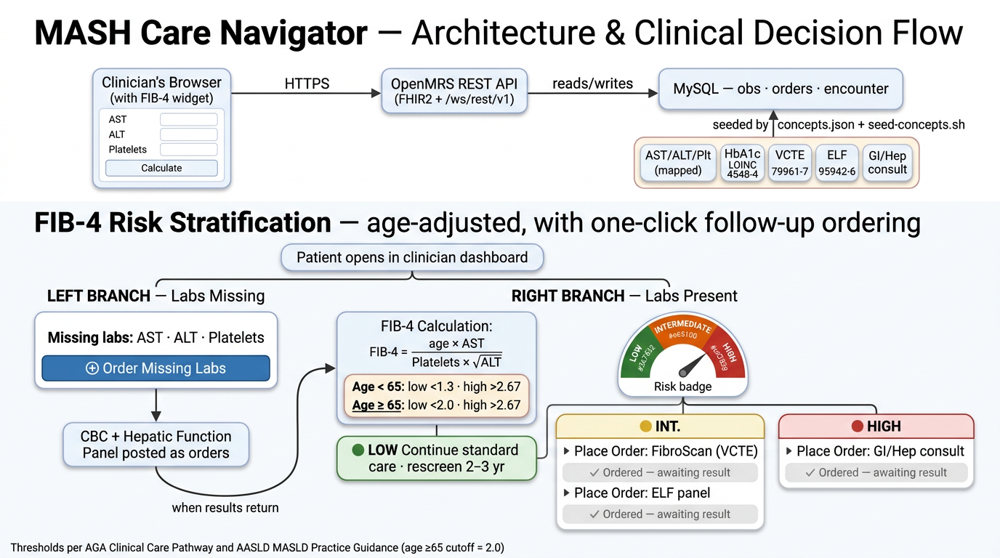

# MASH Care Navigator

Clinical decision support for MASLD / MASH screening and risk stratification —
delivered at the point of care via SMART-on-FHIR and EHR-native widgets.



## Problem
FIB-4 screening gets missed. High-risk MASLD patients don't get flagged in
time, and intermediate-risk patients don't get follow-up testing (FibroScan,
ELF) ordered.

## What this does
- Surfaces lab gaps directly in the provider's patient dashboard.
- Auto-orders missing liver labs (CBC, Hepatic Function Panel) with one click.
- Calculates FIB-4 with an age-adjusted lower cutoff (1.3 default; 2.0 for
  age ≥65, per AGA Clinical Care Pathway).
- Triggers risk-level decision support:
  - **Intermediate (FIB-4 1.3 – 2.67):** order FibroScan (VCTE) or ELF.
  - **High (FIB-4 > 2.67):** place a Gastroenterology / Hepatology consult.

## Repo layout

```
.
├── docs/                 Repo documentation assets (clinical workflow diagram, etc.)
├── web/                  EHR-agnostic SMART-on-FHIR React client (Vite + Tailwind).
└── openmrs/              OpenMRS-specific deploy + customisations.
    ├── widget/           coreapps GSP fragment patched into the patient dashboard.
    ├── concepts/         Replayable manifest of orderable concepts + LOINC codes.
    ├── deploy/           docker-compose stack + OMOD repacker.
    └── scripts/          Concept seeding script.
```

## Quick start

### Web client (`web/`)
```sh
cd web
npm install
npm run dev
```

### OpenMRS deploy (`openmrs/`)
See [`openmrs/README.md`](openmrs/README.md) for the full bring-up steps.
TL;DR:
```sh
cp openmrs/.env.example openmrs/.env   # fill in real values
docker compose -f openmrs/deploy/docker-compose.yml up -d
./openmrs/scripts/seed-concepts.sh
# patch the coreapps OMOD with the FIB-4 widget — see openmrs/README.md
```

## Credits
- Clinical Champion: Dr. Niharika Samala, MD
- Developer: Lalitha Pranathi Pulavarthy, BDS, MS
- Advisor: Dr. Saptarshi Purkayastha, PhD
